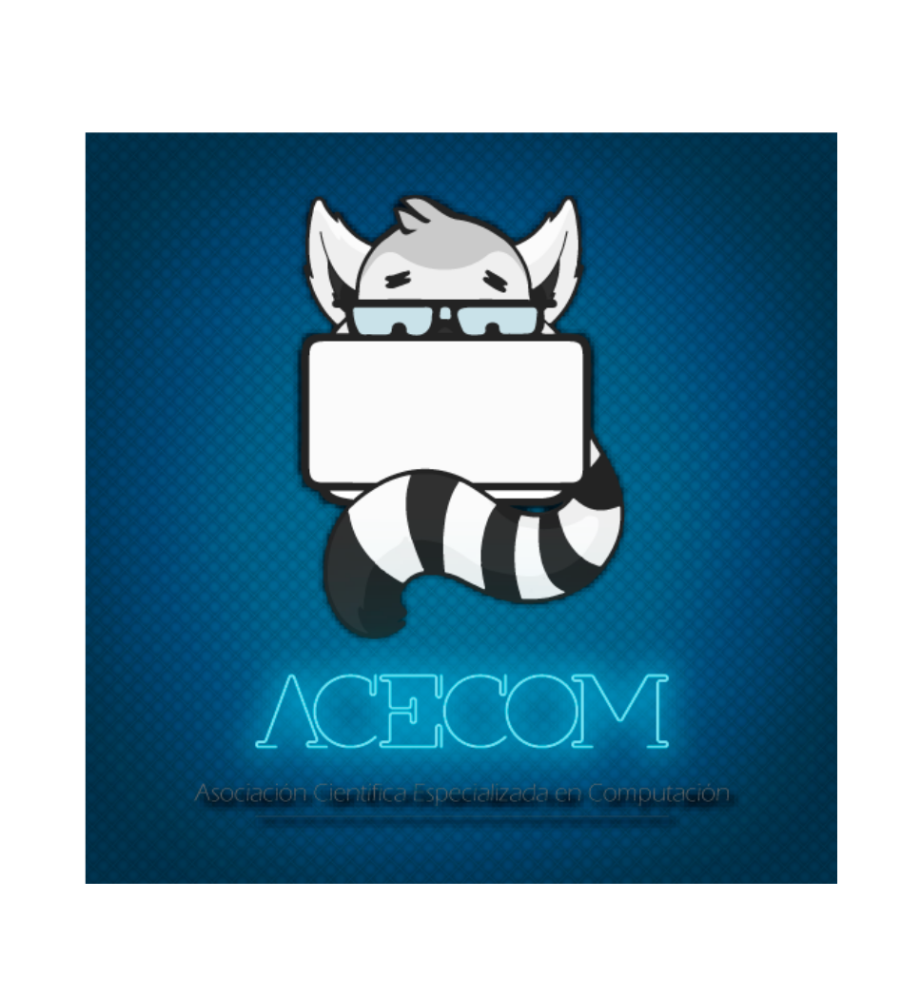

# PAM Project: Deep Reinforcement Learning in Sonic The Hedgehog

## Introduction
This repository contains the source code for my PAM project at ACECOM. It implements Proximal Policy Optimization (PPO) in Sonic The Hedgehog with the goal of completing the first zone. The training environment and model are set up using OpenAI Gymnasium and Stable-Retro.

 


## Author:
Ángel Aarón Flores Alberca

## Requisites:
* Python 3.10
* OS: Windows 10/11, Linux, macOS

## Installation:
Follow these steps to set up correctly the virtual environment and run the model locally:

### 1. Clone this repository
```bash
git clone https://github.com/bxcowo/sonic_genesis_PPO.git
```

### 2. Create and activate virtual environment
To create venv:
```bash
python3 -m venv .venv
```
To activate venv:
- On windows
```bash
.venv\Scripts\activate
```
- On macOS and Linux
```bash
source .venv/bin/activate
```

### 3. Upgrade pip
```bash
pip install --upgrade pip
```

### 4. Install required dependencies
```bash
pip install -r requirements.txt
```

### 5. Edit and run `main.py`
Open [main.py](main.py) in your preferred IDE. Here, you'll find the model definition that trains Sonic to progress through the game. If you’d like to experiment, you can modify hyperparameters by scaling them up or down in multiples of the existing values.
`main.py` launches the training process using 5 CPU cores by default. You can change the training environment by editing [metadata.json](custom_integration/SonicTheHedgehog-Genesis-Custom/metadata.json), there you can switch to any other state saved in the `custom_integration` directory.

### 6. Testing the model
After training is complete, two new files are generated and used by [testing_model.py](testing_model.py). Running this script will test the trained agent and produce `.bk2` files that record the gameplay. The agent will play very quickly, but you can use these `.bk2` files to render a more detailed video playback later.

### 7. Render to video
Before rendering, move the entire `SonicTheHedgehog-Genesis-Custom` directory from [custom_integration](custom_integration) into your virtual environment’s Retro data directory (for example: `.venv/lib/python3.10/site-packages/retro/data/stable`).

Once done, you can render the recorded gameplay into a video using:
```bash
python3 -m retro.scripts.playback_movie SonicTheHedgehog-Genesis-Custom-[Selected zone].[Selected act]-000000.bk2
```

## Important Note
The custom environment is defined inside the [custom_integration](custom_integration) folder and includes:
* **contest.json**: Defines how rewards and the done condition are interpreted.
* **data.json**: Lists RAM variables, their memory addresses, and types.
* **metadata.json**: Specifies which state the agent will load and play.
* **script.lua**: A Lua script that defines the reward function and termination condition.

To adjust environment behaviors, you can modify [script.lua](custom_integration/SonicTheHedgehog-Genesis-Custom/script.lua) or [metadata.json](custom_integration/SonicTheHedgehog-Genesis-Custom/metadata.json). Avoid editing the other files unless you know what you’re doing.


## License
This project is licensed under the MIT License - see the [LICENSE](LICENSE) file for details.
